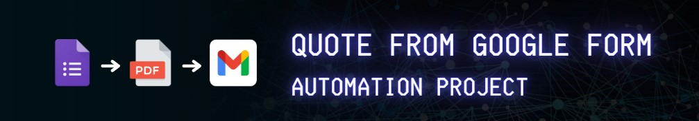

# 📂 Automation Projects

Welcome to the section of my portfolio dedicated to projects involving **automations**.

---

### 📚 Google Form to PDF

- **Description**: The goal is to automate the processing of Google Form submissions by generating a personalized PDF for each response and sending it via Gmail automatically. 
- **Technologies**: `Google Apps Script`, `HTML Template`,  `GmailApp`, `Triggers`
- **Resource**: [` form-automation.gs`](form-automation.gs)

---
